# SmartPrice Insights – Real Estate Platform with ML Price Prediction

SmartPrice Insights is a full-stack real estate web platform that allows users to buy, sell, and explore properties while also predicting property prices using Machine Learning.

This project combines modern web technologies with an advanced Machine Learning model to provide accurate housing price estimates in Bangalore.

## Features

- **User Authentication**: Secure registration and login system.
- **Price Prediction**: Predict property prices using a Scikit-learn model with parameters like square footage, BHK, bathrooms, and location.
- **Property Explorer**: A map-based interface to explore properties across various neighborhoods.
- **Property Listing**: A "Sell Property" module that allows users to list their homes with images, descriptions, and contact information.
- **Market Analytics**: Dynamic charts and insights showing market trends and neighborhood comparisons.
- **Persistent Data Store**: Unified 15-column CSV database for storing both original and user-submitted property listings.

## Technologies Used

- **Backend**: Python, Flask, Flask-CORS, Flask-WTF
- **Machine Learning**: Scikit-learn, Pandas, NumPy, XGBoost
- **Frontend**: HTML5, CSS3, JavaScript (Vanilla ES6+), FontAwesome
- **Mapping**: Leaflet.js
- **Database**: CSV-based data persistence

## Project Structure

```text
/
├── app.py              # Main Flask Application & API Routes
├── util.py             # ML Model loading, Data Processing & CSV Sync
├── templates/          # HTML Templates (Index, Predict, Dashboard, etc.)
├── static/             # Assets (CSS, JS, Images, Uploads)
│   ├── js/app.js       # Core frontend logic
│   └── uploads/        # User-submitted property images
├── server/
│   ├── bengalaru_house_prices.csv   # Unified 15-column CSV dataset
│   └── artifacts/       # Trained ML Models (Pickle) and Columns (JSON)
└── requirements.txt    # Python dependencies
```

## How to Run

1. **Install Dependencies**:
   ```bash
   pip install flask flask-cors flask-wtf pandas numpy scikit-learn xgboost
   ```

2. **Start the Server**:
   ```bash
   python app.py
   ```

3. **Access the Platform**:
   Open: [http://127.0.0.1:5000/](http://127.0.0.1:5000/)

## Modules

- **Authentication System**: Manages user sessions and secure login.
- **Price Prediction Engine**: Processes inputs and uses the Pickle model for real-time inference.
- **Data Synchronization**: Automatically handles CSV header expansion and multi-field persistence.
- **Analytics Dashboard**: Visualizes data trends using interactive charts.


## Author
Bharat Sarkar

## 📸 Screenshots

### 🏠 Home Page

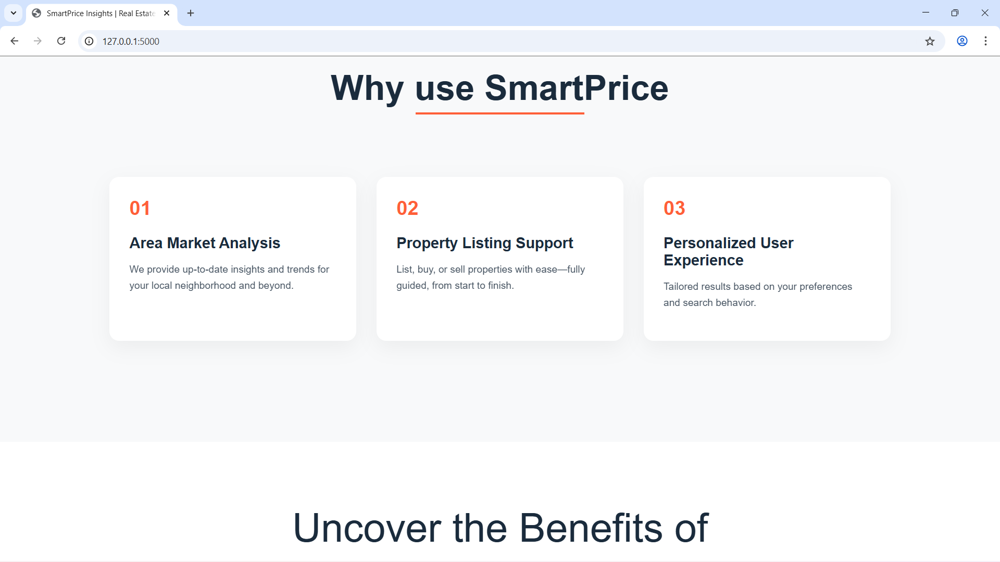
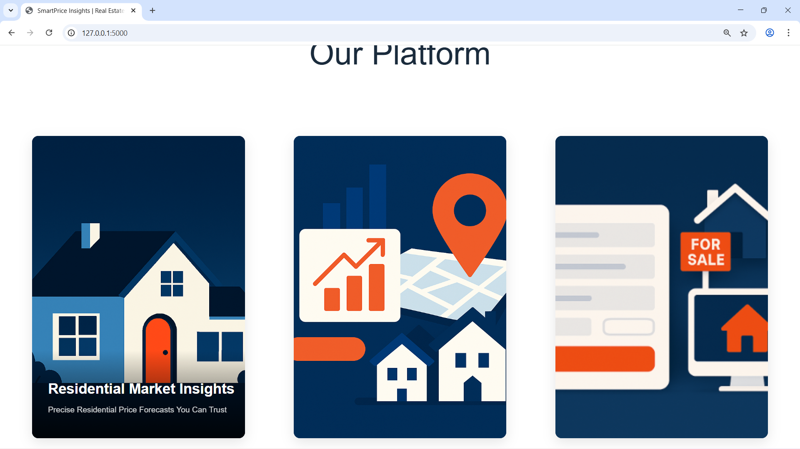

---

### 🔐 Authentication (Login & Signup)
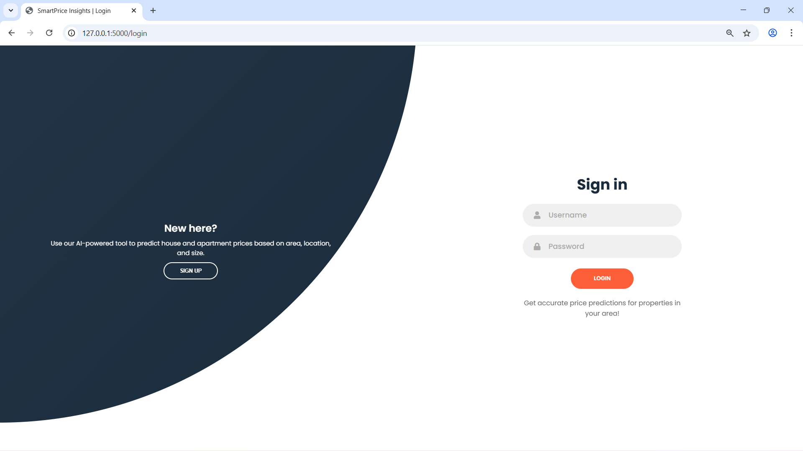
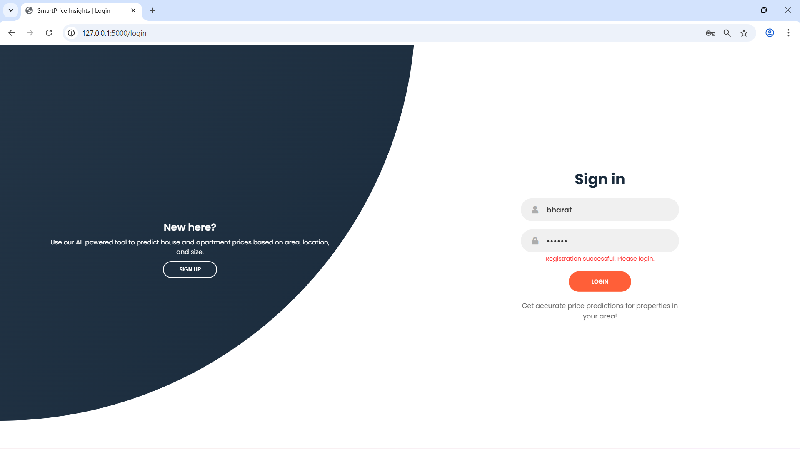


---

### 📊 Dashboard


---

### 💰 Price Prediction
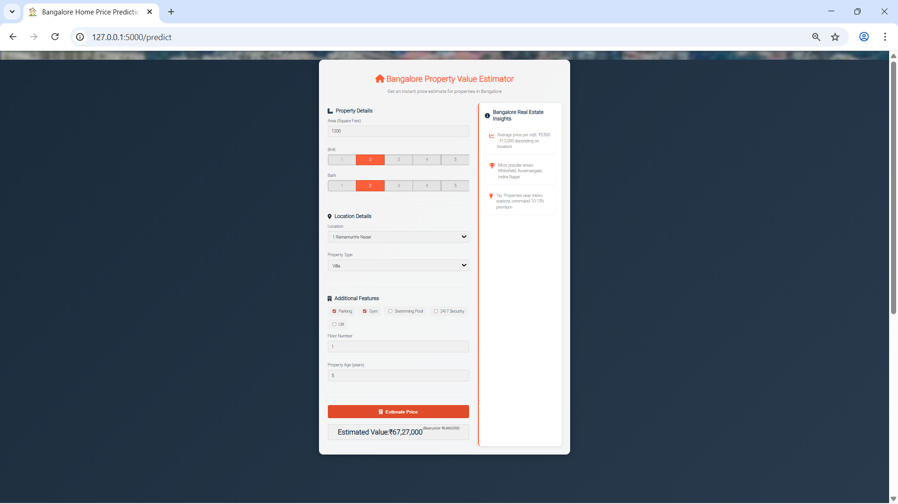
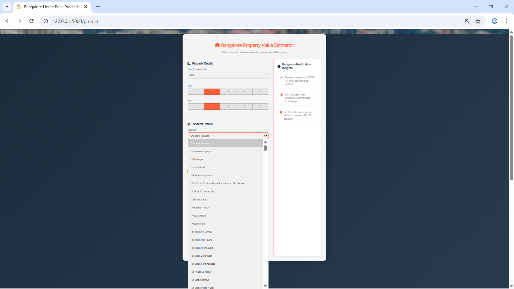
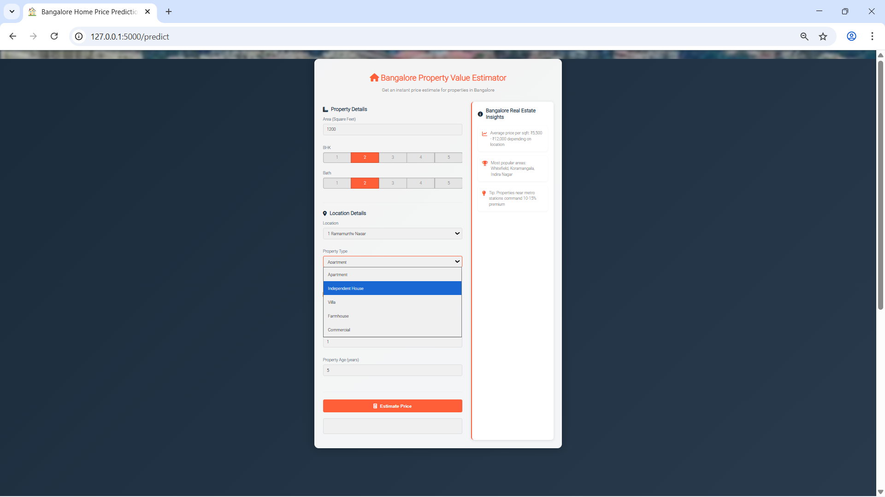

---

### 📈 Market Analytics
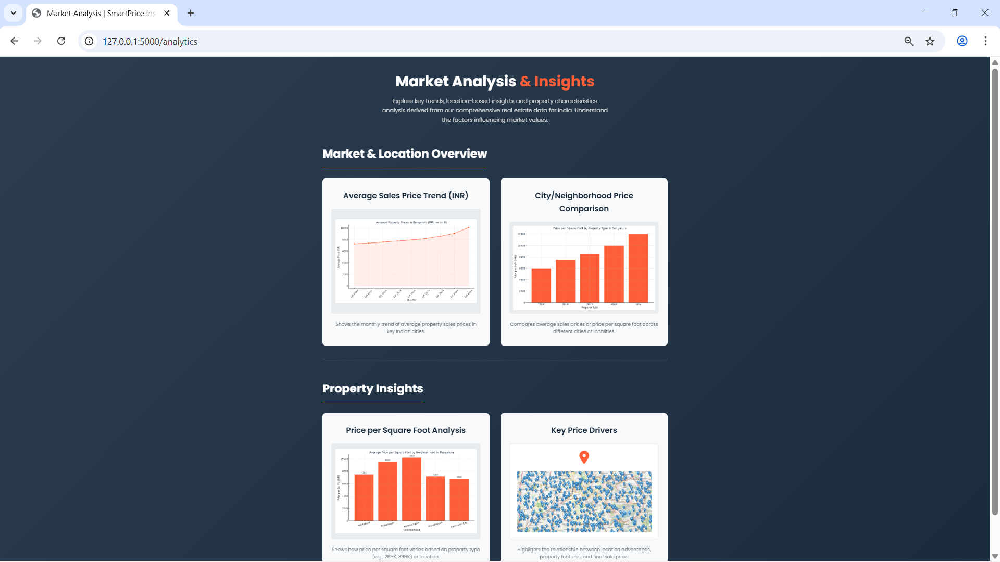

---

### 🏘️ Buy / Explore Properties
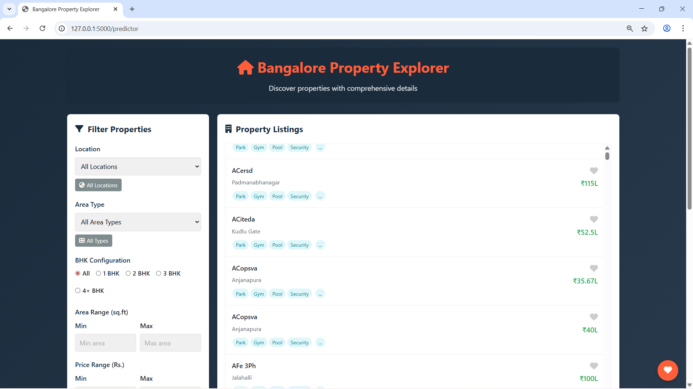
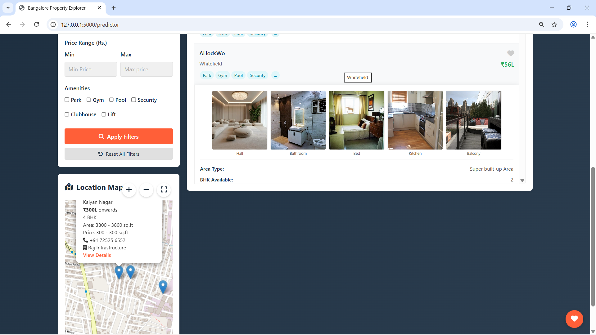
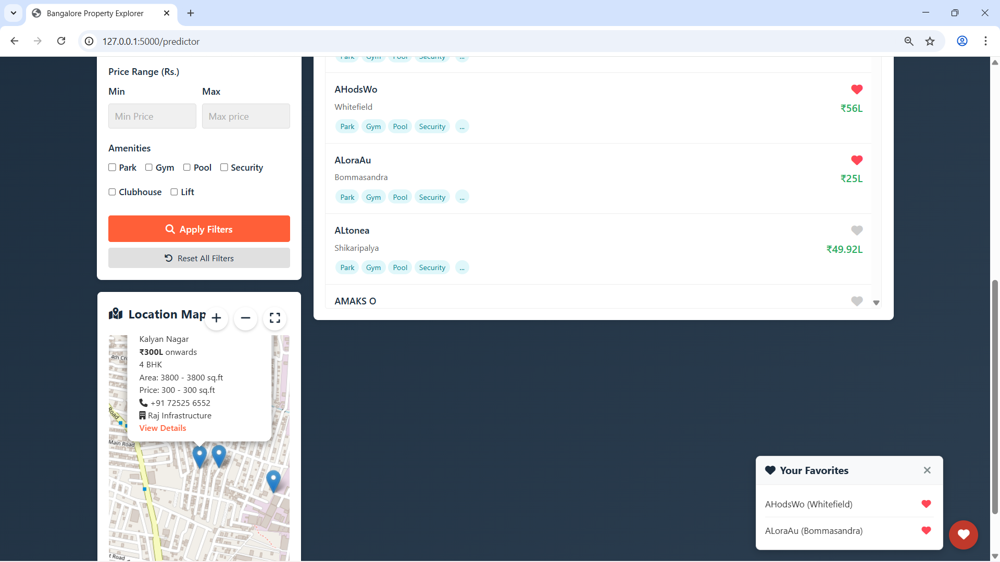
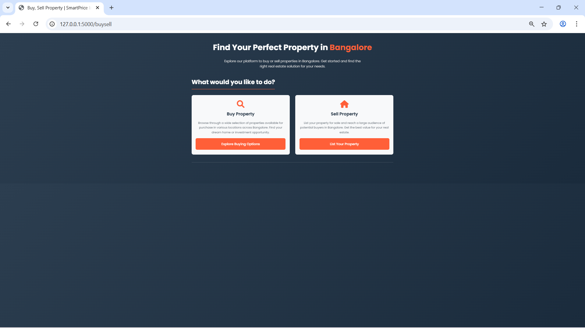

---

### 🗺️ Map View
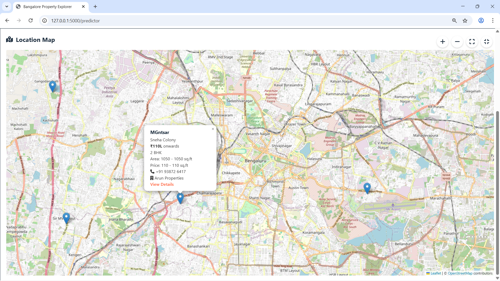

---

### 🏡 Sell Property
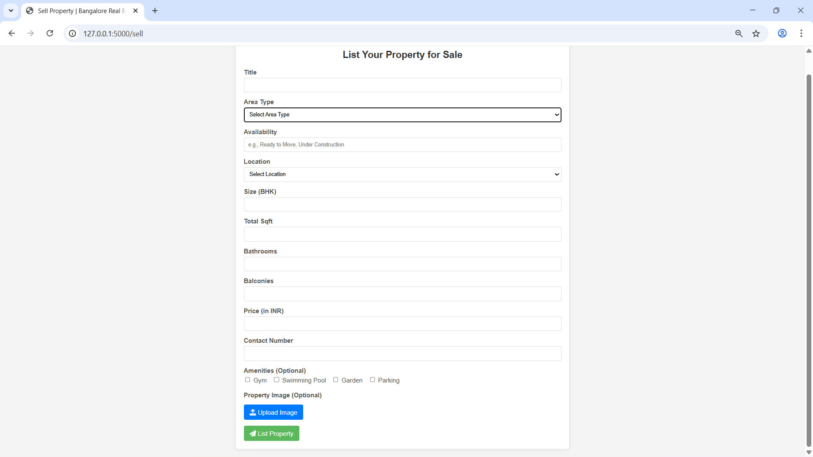
